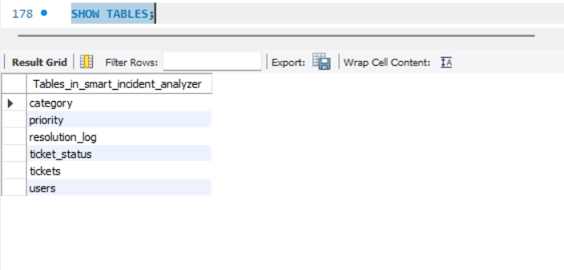
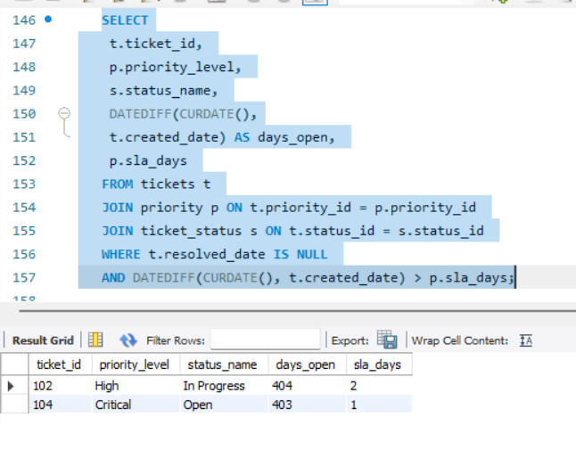
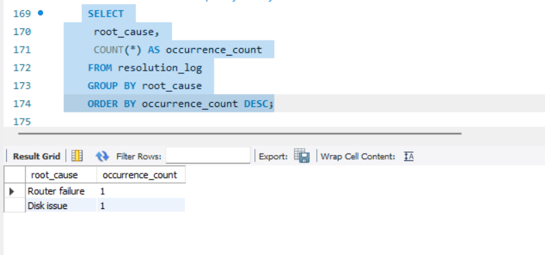

# Smart Incident Resolution Analyzer

This project simulates an IT service desk system using SQL. It analyzes service tickets to identify SLA breaches, high-risk incidents, and recurring root causes.

## Features
- Ticket, priority, and status management
- SLA breach detection using date-based SQL queries
- Incident trend and root cause analysis
- Normalized relational database design

## Technologies Used
- SQL
- MySQL
- MySQL Workbench

## Use Case
Helps IT operations teams monitor service performance, identify delays, and improve incident resolution efficiency.

## Project Screenshots

### Database Tables
Shows the relational structure used to manage users, tickets, priorities, and statuses.

---

### SLA Breach Detection
Identifies tickets where resolution time exceeded defined SLA limits.

---

### High-Risk Open Incidents
Displays high and critical priority tickets that are still open beyond SLA.

---

### Root Cause Analysis
Highlights recurring root causes to support preventive actions.

